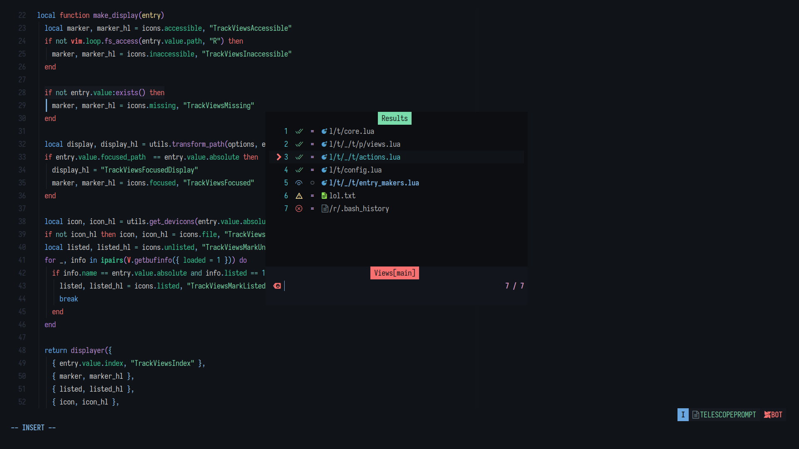
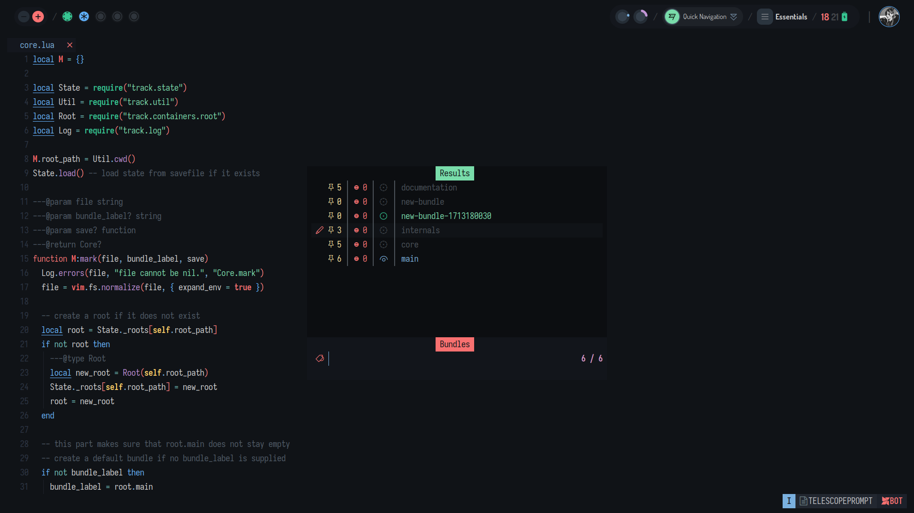

# track.nvim

Most over-engineered marking system. Harpoon like file tracking.
Supercharged by [telescope.nvim](https:/github.com/nvim-telescope/telescope.nvim).

 
 

## Installation

Using [lazy.nvim](https://github.com/folke/lazy.nvim).

<details>

```lua
-- no configuration needed
"dharmx/track.nvim",

-- recommended lazy load
{
  "dharmx/track.nvim",
  config = function()
    local set = vim.keymap.set -- tweak to suit your own
    set("n", "<leader><leader>", "<cmd>Track<cr>", silent)
    set("n", "<leader>ee", "<cmd>Track bundles<cr>", silent)
    set("n", "<leader>aa", "<cmd>Mark<cr>", silent)
    set("n", "<leader>dd", "<cmd>Unmark<cr>", silent)

    -- alternatively require("track").setup()
    require("track").setup({ -- non-nerdfonts icons
      pickers = {
        bundles = {
          prompt_prefix = " > ",
          selection_caret = " > ",
          icons = {
            separator = " ",
            main = "*",
            alternate = "/",
            inactive = "#",
            mark = "=",
            history = "<",
          }
        },
        views = {
          selection_caret = " > ",
          prompt_prefix = " > ",
          icons = {
            separator = " ",
            terminal = "#",
            manual = "^",
            missing = "?",
            accessible = "*",
            inaccessible = "x",
            focused = "@",
            listed = "S",
            unlisted = "$",
            file = ".",
            directory = "~",
          },
        },
      },
    })
  end,
  cmd = {
    "Mark",
    "MarkOpened",
    "StashBundle",
    "RestoreBundle",
    "AlternateBundle",
    "Unmark"
  },
},
```

</details>

## Quickstart

Feature walkthrough.

### Q. How does tracking files work?

- Create a mark by `:Mark`. You can map a key to it.
- Now, open the telescope window by `:Track views`.
- You can move the entries up and down by pressing `i_<C-n>` and `i_<C-p>`.
- You can select all entries by pressing `v`. And, `<cr>` to open.
- Or, press `<tab>` to select multiple entries.
- You can delete an entry by `i_<C-d>`.
- You can change the view name in telescope by pressing `i_<C-e>` on the entry.
- Close the telescope window then do `:Unmark`.
- Open `:Track views` again. And, you should see the mark being erased.

Note that, you can also track commands, man-pages and help-docs.

### Q. How does bundles work?

- Open `:Track bundles`.
- If the picker is empty then the current directory is not being tracked.
- Then start by marking a file in that directory `:Mark some/path/to/file` or,
  just `:Mark`.
- Now, open `:Track bundles` again. You will see a `main` branch being created.
- You can change the bundle name in telescope by pressing `i_<C-e>` on the entry.
- `:StashBundle` will create another bundle with an auto-generated label and
  replace the place of the **main** bundle.
- Try `Track bundles` again.
- `:AlternateBundle` will swap the current **main** bundle with the **alternate**
  bundle. This functions the same way as Vim's default `^` mapping.

Note that, there can only be one `main` bundle and one **alternate** bundle. And,
a bundle will always have a main bundle. It is not recommended to remove it.

### Q. How do I mark a terminal command?

- Open terminal by `:terminal ls /sys/class`
- Alternatively, you can also do `:edit term://ls /sys/class`
- Then `:Mark` that buffer.
- Open `:Track` and you should see the command being stored there.

See <samp>:help terminal</samp> for more details.

### Q. How do I mark a command that'll run on a particular directory?

- Open terminal by `:edit term:///home/dharmx//rg --files \|\ awk -F'.' '{print $NF}'`
- Then `:Mark` that buffer.
- Open `:Track` and you should see the command being stored there.
- Run it by pressing enter and it should run that command in that particualar directory.

Note that, if you mark with `:edit` then you would only need to escape pipes i.e. `| -> \|`.
And, if you mark with `:Mark` then you need to escape pipes and spaces as well.

### Q. What else can we mark?

- You can mark websites i.e. `:Mark https://www.google.com/search?q=gnu+rule34`.
- You can mark manpages i.e. `:Mark man://find(1)`.
- You can mark a directory as well.

Note that, selecting a directory i.e. tracked will `:chdir` into that directory and
refresh the UI for viewing that directory's marks. This behavior is off by default.

Additionally, while you can mark virtually anything, it is not recommended to do so.
This is because only a few filetypes are actually handled. For instance, marking a
PDF file and opening it won't open it in a PDF reader but in Neovim.

## Defaults

```lua
local if_nil = vim.F.if_nil
local util = require("track.util")

M._defaults = {
  save_path = vim.fn.stdpath("state") .. "/track.json",
  root_path = true,
  bundle_label = true,
  icons = {
    -- marks
    separator = " ",
    locked = " ",
    terminal = " ",
    manual = " ",
    site = " ",
    missing = " ",
    accessible = " ",
    inaccessible = " ",
    focused = " ",
    listed = "",
    unlisted = "≖",
    file = "",
    directory = "",
    -- bundles
    main = " ",
    alternate = " ",
    inactive = " ",
    mark = "",
    history = "",
    -- pad
    saved = "",
    save = "",
  },
  pickers = {
    bundles = {
      save_on_close = true,
      prompt_prefix = "   ",
      selection_caret = "   ",
      previewer = false,
      initial_mode = "normal", -- alternatively: "insert"
      sorting_strategy = "ascending",
      results_title = false,
      layout_config = {
        prompt_position = "top",
        preview_cutoff = 1,
        width = function(_, max_col, _) return math.min(max_col, 70) end,
        height = function(_, _, max_line) return math.min(max_line, 15) end,
      },
      hooks = {
        on_close = util.mute,
        on_open = util.mute,
        on_serial = function(entry)
          local root, _ = util.root_and_bundle()
          root:change_main_bundle(entry.value.label)
        end,
        on_choose = function(self)
          local entry = self:get_selection()
          if not entry then return end
          local root, _ = util.root_and_bundle()
          root:change_main_bundle(entry.value.label)
        end,
      },
      attach_mappings = function(_, map)
        local actions = require("telescope.actions")
        map("n", "q", actions.close)
        map("n", "v", actions.select_all)

        local track_actions = require("telescope._extensions.track.actions")
        map("n", "D", actions.select_all + track_actions.delete_bundle)
        map("n", "dd", track_actions.delete_bundle)
        map("i", "<C-D>", track_actions.delete_bundle)
        map("i", "<C-E>", track_actions.change_bundle_label)
        map("n", "s", track_actions.change_bundle_label)
        return true -- compulsory
      end,
    },
    views = {
      switch_directory = true,
      save_on_close = true, -- save when the view telescope picker is closed
      selection_caret = "   ",
      path_display = {
        absolute = false, -- /home/name/projects/hello/mark.lua -> hello/mark.lua
        shorten = 1, -- /aname/bname/cname/dname.e -> /a/b/c/dname.e
      },
      prompt_prefix = "   ",
      previewer = false,
      initial_mode = "normal", -- alternatively: "insert"
      results_title = false,
      sorting_strategy = "ascending",
      layout_config = {
        prompt_position = "top",
        preview_cutoff = 1,
        width = function(_, max_col, _) return math.min(max_col, 70) end,
        height = function(_, _, max_line) return math.min(max_line, 15) end,
      },
      hooks = {
        on_close = util.mute,
        on_open = util.mute,
        on_serial = util.open_entry,
        on_choose = function(self)
          local entries = if_nil(self:get_multi_selection(), {})
          if #entries == 0 then table.insert(entries, self:get_selection()) end
          for _, entry in ipairs(entries) do util.open_entry(entry) end
        end,
      },
      attach_mappings = function(_, map)
        local actions = require("telescope.actions")
        map("n", "q", actions.close)
        map("n", "v", actions.select_all)

        local track_actions = require("telescope._extensions.track.actions")
        map("n", "D", actions.select_all + track_actions.delete_view)
        map("n", "dd", track_actions.delete_view)
        map("n", "s", track_actions.change_mark_view)
        map("n", "<C-b>", track_actions.delete_buffer)
        map("n", "<C-j>", track_actions.move_view_next)
        map("n", "<C-k>", track_actions.move_view_previous)

        map("i", "<C-d>", track_actions.delete_view)
        map("i", "<C-n>", track_actions.move_view_next)
        map("i", "<C-p>", track_actions.move_view_previous)
        map("i", "<C-e>", track_actions.change_mark_view)
        return true -- compulsory
      end,
      disable_devicons = false,
    },
  },
  log = {
    plugin = "track",
    level = "warn",
  },
  -- dev features / not implemented
  disable_history = true,
  maximum_history = 10,
  pad = {
    spacing = 1,
    serial_maps = true,
    auto_create = true,
    save_on_close = true,
    hooks = {
      on_choose = util.open_entry,
      on_serial = util.open_entry,
    },
    mappings = {
      n = {
        q = function(self) self:close() end,
        ["<C-s>"] = function(self) self:sync(true) end,
      },
    },
    disable_devicons = false,
    config = {
      style = "minimal",
      border = "solid",
      focusable = true,
      relative = "editor",
      width = 60,
      height = 10,
      title_pos = "left",
    },
  },
}
```

## Integrations

Use track.nvim for marking elements in other plugins.

### rnvimr

Mark current selected file.

```lua
vim.g.rnvimr_action = {
  ["<C-t>"] = "NvimEdit Mark true",
}
```

## Theme

Modify these to change colors. This section is mainly geared towards theme plugin authors.

```lua
local function HI(...) vim.api.nvim_set_hl(0, ...) end

HI("TrackPadTitle", { link = "TelescopeResultsTitle" })

HI("TrackViewsAccessible", { foreground = "#79DCAA" })
HI("TrackViewsInaccessible", { foreground = "#F87070" })
HI("TrackViewsFocusedDisplay", { foreground = "#7AB0DF" })
HI("TrackViewsFocused", { foreground = "#7AB0DF" })
HI("TrackViewsIndex", { foreground = "#54CED6" })
HI("TrackViewsMarkListed", { foreground = "#4B5259" })
HI("TrackViewsMarkUnlisted", { foreground = "#C397D8" })
HI("TrackViewsMissing", { foreground = "#FFE59E" })
HI("TrackViewsFile", { foreground = "#FFE59E" })
HI("TrackViewsDirectory", { foreground = "#FFE59E" })
HI("TrackViewsSite", { foreground = "#66B3FF" })
HI("TrackViewsTerminal", { foreground = "#36C692" })
HI("TrackViewsManual", { foreground = "#5FB0FC" })
HI("TrackViewsDivide", { foreground = "#4B5259" })
HI("TrackViewsLocked", { foreground = "#E37070" })

HI("TrackBundlesInactive", { foreground = "#4B5259" })
HI("TrackBundlesDisplayInactive", { foreground = "#4B5259" })
HI("TrackBundlesMain", { foreground = "#7AB0DF" })
HI("TrackBundlesDisplayMain", { foreground = "#7AB0DF" })
HI("TrackBundlesAlternate", { foreground = "#36C692" })
HI("TrackBundlesDisplayAlternate", { foreground = "#79DCAA" })
HI("TrackBundlesMark", { foreground = "#FFE59E" })
HI("TrackBundlesHistory", { foreground = "#F87070" })
HI("TrackBundlesDivide", { foreground = "#151A1F" })
HI("TrackBundlesIndex", { foreground = "#54CED6" })
```

## Commands

```vim
:Mark                   " add current buffer as mark
:Mark <URI>             " add passed <URI> as mark
:Unmark                 " rm current mark (if exists)
:Unmark <URI>           " rm <URI> mark (if exists)
:MarkOpened             " mark all opened buffers
:StashBundle            " stash current main bundle and make new bundle as main 
:RestoreBundle          " restore previous bundle
:DeleteBundle           " rm main bundle
:AlternateBundle        " swap stashed and main bundles
:Track                  " open default pad UI (view)
:Track pad              " open default pad UI (view)
:Track views            " open views telescope picker
:Track bundles          " open bundles telescope picker
:Track save             " save current state to file
:Track load             " load saved state for the first time
:Track loadsave         " load saved state from a file
:Track reload           " load last saved state to cache
:Track wipe             " clear caches
:Track remove           " rm save file
:Track menu             " telescope picker for available track pickers
" TODO: no root, roots, bundles indicators for Track menu
```

## Credits

- harpoon
- @nikfp
